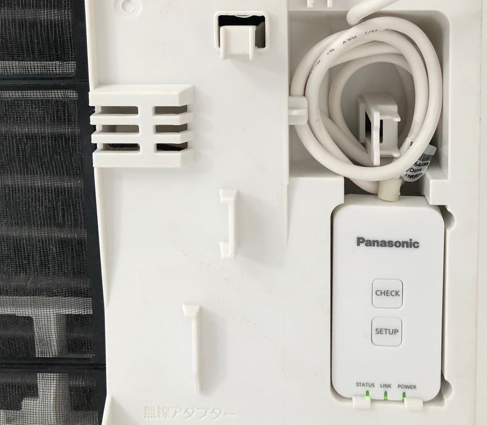
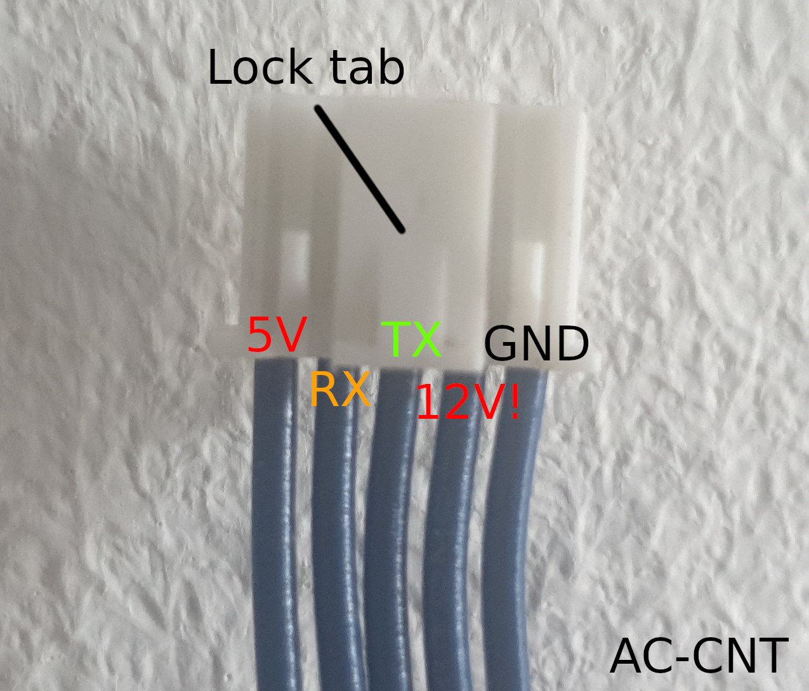
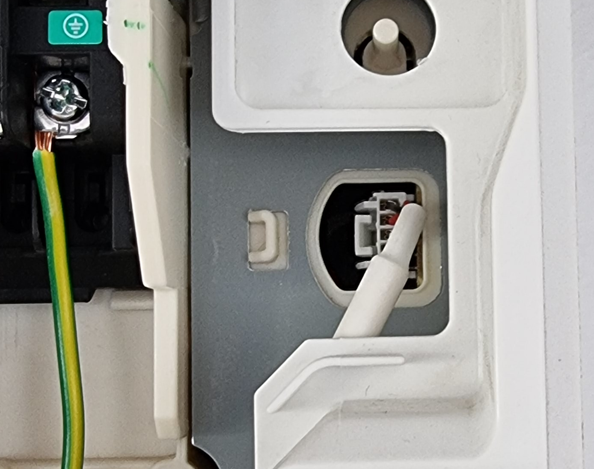

# Hardware installation

This hardware installation guide assumes you already have a Panasonic CZ-TACG1 installed and want to replace it.

* Solder your ESP to your logic converter like this:

| **ESP32** | **Logic Converter**           | **AC connector** | **Notes** |
| --------- | ------------- | ---------------- | ----------- |
| 5V/VIN    | VCC/HV | 5V | Provides the ESP32 with power from the AC, make sure to connect it to the high voltage side if your logic converter has one |
| 3.3V      | VCC/LV | - | Connect the logic converter to 3.3V on the LV side |
| GND       | GND    | GND | Connect any ground from the ESP32 to the ground of the logic converter low voltage side |
| GPIO16    | LV1    | - | Connect GPIO16 to the first of your logic converter channels (Low voltage) |
| GPIO17    | LV2    | - | Connect GPIO17 to the second of your logic converter channels (Low voltage |
| -    | HV1    | RX | Connect the first of your logic converter channels to the AC RX pin (High voltage) |
| -    | HV2    | TX | Connect the second of your logic converter channels to the AX TX pin (High voltage) |

* Disconnect the AC mains supply
* Open up the front of your AC
* Open up the mains supply on the right to gain easier access to the CN-CNT connector
* Your wifi adapter should be located in a plastic slot or outside of your AC

* Remove the old wifi adapter and unplug it
* Solder 4 jumper cables to the CN-CNT wires (https://github.com/Egyras/HeishaMon#where-to-get-connectors)

  * Note: RX/TX is from the direction of the ESP, not the AC.
* Heat shrink the individual wires (**do not skip this step to avoid short ciruits**)
* Connect the jumper cables to your logic converter
* Place the ESP and the logic converter in the slot for the wifi adapter (you can use some velcro to fix it in place)
* Plug in the ESP at the CN-CNT connector

Reconnect the AC mains supply. You can now connect this ESP to Home Assistant and control it from there.
