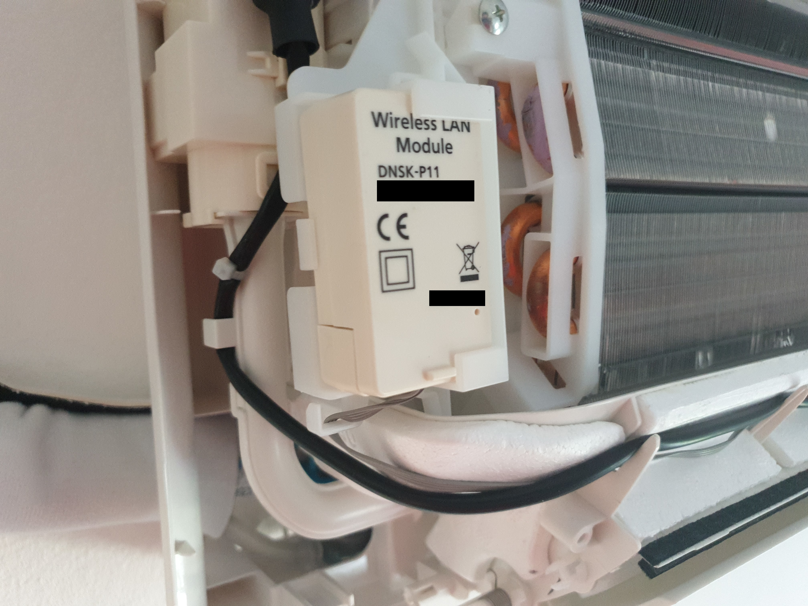
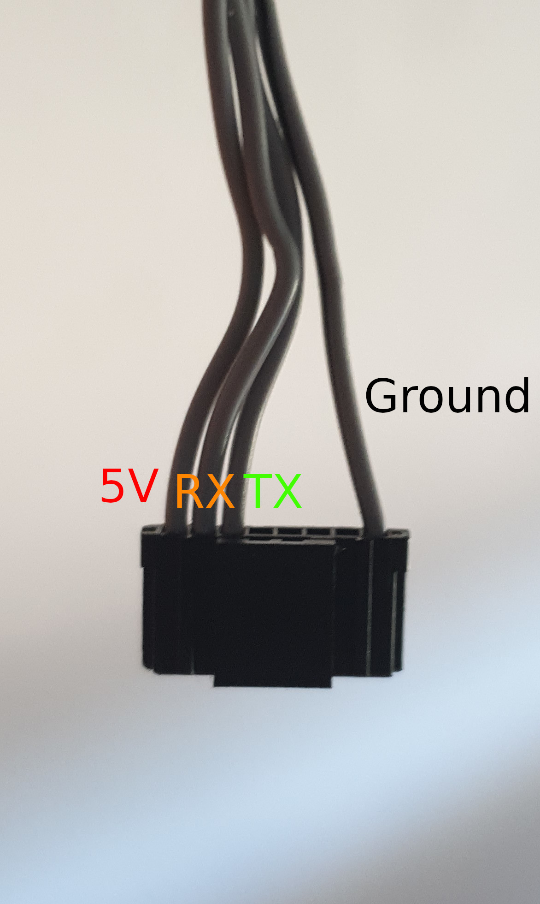
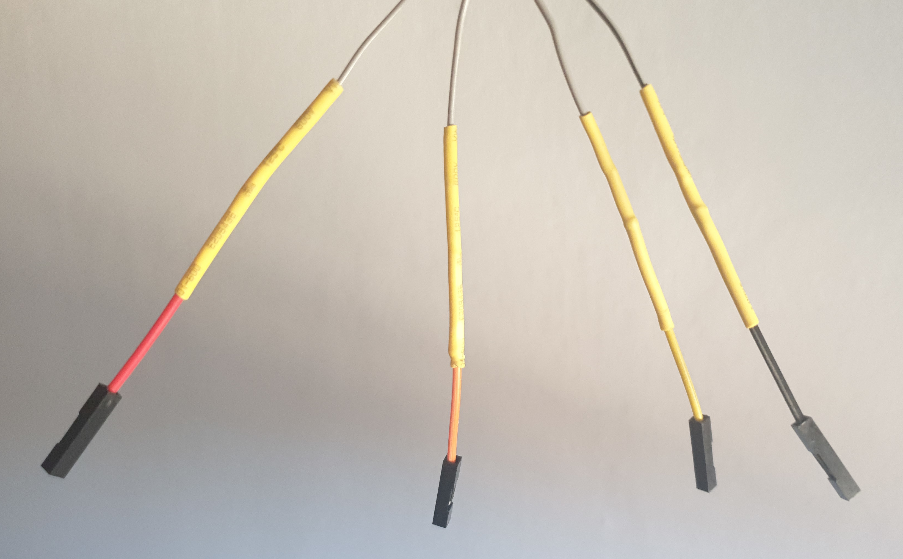
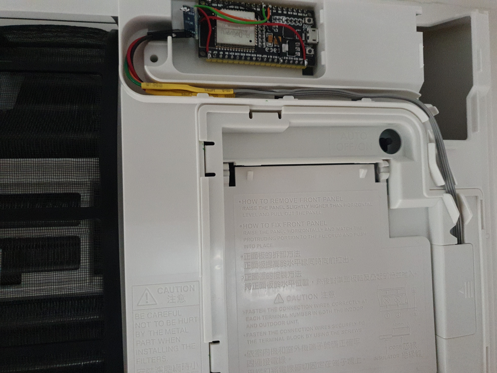

# Overview

An open source alternative for the Panasonic wi-fi adapter that works locally without the cloud.

# Features

* Control your AC locally via Home Assistant, MQTT or directly
* Instantly control the AC without any delay like in the Comfort Cloud app
* Receive live reports and state from the AC
* Uses the UART interface on the AC instead of the IR interface
* Provides a drop-in replacement for the Panasonic DNSK-P11 wifi module

# Supported hardware

Confirmed working with the Etherea series split and multi split units via the internal CN-WLAN connector. The library was only tested with the integrated wifi adapter, not via the CN-CNT connector or the external wifi adapter.

Tested on ESP32, should work on ESP8266 but ESP32 is preferred for the multiple hardware serial ports.

# Requirements

* ESP32 or ESP8266 ([supported by ESPHome](https://esphome.io/#devices))
* 5V to 3.3V bi-directional Logic Converter (minimum 2 channels, available as pre-soldered prototyping boards)
* Female-Female Jumper cables
* Soldering iron
* Wires to solder from Logic converter to ESP
* Heat shrink
* ESPHome 1.15.0 or newer

# Notes

* **Make sure to disconnect mains power before opening your AC, the mains contacts are exposed and can be touched by accident!**
* **Do not connect your ESP32/ESP8266 directly to the AC, the AC uses 5V while the ESPs use 3.3V!**
* **While installation is fairly straightforward I do not take any responsibility for any damage done to you or your AC during installation**
* This library was only tested with the CN-WLAN connector, not on the CN-CNT connector that the old wifi adapter uses.

# Software installation

This software installation guide assumes some familiarity with ESPHome.

* Pull this repository
* Adjust the ac.yaml to your needs
* Connect your ESP
* Run `esphome ac.yaml run` and choose your serial port (or do this via the Home Assistant UI)
* If you see the handshake messages being sent in the log you are good to go
* Disconnect the ESP and continue with hardware installation

# Hardware installation

This hardware installation guide assumes you already have a Panasonic DNSK-P11 installed and want to replace it. If you do not have a DNSK-P11 installed but your AC has the CN-WLAN connector you will have to find a fitting connector and route a cable from the mainboard yourself.

* Solder your ESP to your logic converter like this:

| **ESP32** | **Logic Converter**           | **AC connector** | **Notes** |
| --------- | ------------- | ---------------- | ----------- |
| -        | VCC/HV | 5V | Provides the ESP32 with power from the AC, make sure to connect it to the high voltage side if your logic converter has one |
| 3.3V      | VCC/LV | - | Connect the logic converter to 3.3V on the LV side |
| GND       | GND    | GND | Connect any ground from the ESP32 to the ground of the logic converter low voltage side |
| GPIO16    | LV1    | RX | Connect GPIO16 to the first of your logic converter channels |
| GPIO17    | LV2    | TX | Connect GPIO17 to the second of your logic converter channels |

* Disconnect the AC mains supply
* Open up your AC according to the manual
* Your wifi adapter should be located on the left side of the unit like this:

* Remove the old wifi adapter and unplug it
* Optional: While you can install the ESP where the old unit was I recommend rerouting the wire to the right side of the unit and placing the ESP where the external adapter sits. This makes it easier to replace in the future and doesn't require you to open your AC again
* Cut off the cable where the wifi connector sits:

Note: RX/TX is from the direction of the ESP, not the AC.
* Solder 4 jumper cables to the exposed wires
* Heat shrink the individual wires (**do not skip this step to avoid short ciruits**)

* Thread the now dangling wire through the front of the case
* Reinstall the front case of the AC as you would normally do
* Connect the jumper cables to your logic converter
* Place the ESP and the logic converter in the top right slot for the wifi adapter (you can use some velcro to fix it in place)
* Install the front cover and we are done

Reconnect the AC mains supply and turn wifi back on. You should see a flashing wifi LED, followed by a faster flashing wifi LED and a solid wifi LED after about a minute. You can now connect this ESP to Home Assistant and control it from there.
